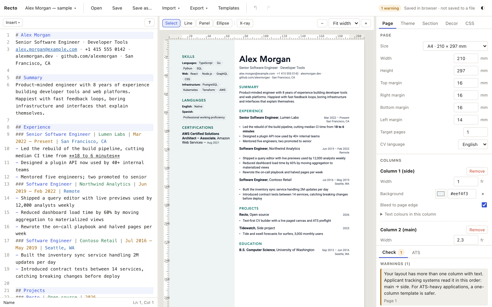

# Recto

Recto is a text-first CV builder. You write your CV in a small, strict Markdown dialect, and a live, paged canvas shows the result exactly as it will print. You set margins, columns, panels and lines by dragging them on the page. Preflight checks catch problems before a recruiter or an applicant tracking system (ATS) sees them. The PDF comes from Chromium's print engine, with real, selectable text in the reading order the ATS X-ray shows you. There are no accounts and no backend. The whole app is a folder of static files with zero dependencies and no build step: run it on your laptop or put it on any static host.



## Features

- **Text-first.** Content is plain text in [Recto Markdown](docs/syntax.md): `## Section`, `### Title | Org | Date | Location`, bullets. It diffs well, survives copy and paste, and needs no forms.
- **Visual layout on a live canvas.** Drag the margins, the gutter and the column widths. Drag sections between columns. Draw lines, panels and ellipses anywhere on the page. Every drag also has a numeric input in the inspector.
- **Preflight.** More than 30 checks for missing contact details, invalid emails and URLs, dates that are mixed, out of order or in the future, pages over target, text that is too small, low contrast, hidden link targets, emoji and invisible characters, and more. Many problems have a one-click **Fix**.
- **ATS X-ray.** Numbers every block in PDF stream order and shows the exact text an ATS extracts, page by page, along with the fields it detects.
- **Templates.** Eight built-in templates (classic, modern, minimal, compact, timeline, executive, academic, bold). The gallery previews each one with *your* content, and **Remix** suggests a new look.
- **Fit to N pages**, custom fonts, a photo, custom CSS, and JSON Resume import and export. You can also paste the text of an old CV to import it.
- **Local and hosted, same bundle.** `node serve.js` on your machine, or any static host. A Dockerfile and a GitHub Pages workflow are included.
- **CLI.** `node cli/recto.js export cv.cv.json -o cv.pdf` for scripted and CI builds.
- **Zero dependencies.** No runtime or dev dependencies and no build step. It uses native ES modules, and the tools run on the Node standard library.

## Quick start

You need Node 20 or newer.

```sh
git clone https://github.com/ramamona/recto.git
cd recto
node serve.js            # → http://127.0.0.1:8710
```

`serve.js` binds to `127.0.0.1`. Use `--port 9000` or `--host 0.0.0.0` to change the port or the interface. If the port is taken, it tries the next port (up to 10 attempts) and prints the URL it used. Any other static file server works too, such as `python3 -m http.server`.

**Opening `index.html` straight from disk (`file://`) is not supported.** Browsers block ES modules on `file://` URLs, so always serve the folder over HTTP.

On the first run, the app loads a sample CV. Pick a look with **Templates** in the top bar, edit the text on the left, and print with **Export → PDF (print)** or `Cmd/Ctrl+P`. In the print dialog choose **Save as PDF**.

## Hosting

The repository root *is* the app. Upload the folder to any static host (GitHub Pages, Netlify, Cloudflare Pages, S3, nginx). Nothing is stored on the server, and a hosted instance works exactly like a local one. See [docs/self-hosting.md](docs/self-hosting.md) for Docker, GitHub Pages and the files you can leave out.

```sh
docker build -t recto . && docker run --rm -p 8080:80 recto
```

## CLI

```sh
node cli/recto.js export my.cv.json -o cv.pdf            # PDF through headless Chrome/Chromium/Edge/Brave
node cli/recto.js export my.cv.json -o cv.txt            # ATS plain text, no browser needed
node cli/recto.js export my.md -o resume.json            # JSON Resume
node cli/recto.js check my.cv.json --template classic    # preflight; exit code 1 on errors
```

See [docs/cli.md](docs/cli.md) for the input formats, the exit codes and a CI example.

## Privacy

Recto has no accounts, no backend, no analytics and no telemetry. Your CV lives in your browser's `localStorage`, uploaded fonts live in IndexedDB, and copies exist only in files you save. A strict Content-Security-Policy stops the app from making any request outside its own origin, including `url(https://…)` in custom CSS. A hosted instance serves static files and never receives your data.

## Browser support

- **Chromium (Chrome, Edge, Brave):** exact. The printed PDF has the same pages and page breaks as the canvas.
- **Firefox and Safari:** best-effort. Editing works. Before printing, the app shows a checklist: paper size, 100 % scale, headers and footers off, background graphics on.

Page breaks come from real font metrics. The built-in font stacks end in metric-compatible fallbacks (Arial/Liberation Sans/Arimo, Times New Roman/Liberation Serif/Tinos, Courier New/Liberation Mono/Cousine), but the same CV **can still break differently on another OS** that resolves the stack to another font. For identical breaks everywhere, upload a custom font. Saved `.cv.json` files embed it.

## Documentation

- [Recto Markdown syntax](docs/syntax.md)
- [Templates and the styling contract](docs/templates.md)
- [Self-hosting](docs/self-hosting.md)
- [CLI](docs/cli.md)
- [Architecture and manual QA checklist](docs/architecture.md)

## Contributing

Contributions are welcome, especially templates and translations. Read [CONTRIBUTING.md](CONTRIBUTING.md) first: the project has a hard rule of zero dependencies and no build step.

## License

[MIT](LICENSE) © 2026 ramamona
